<div align="center">

# 📖 Blog App — CodeIgniter 4 + Shield

**Curso completo e gratuito no YouTube: do zero ao deploy, um commit por aula.**

[](https://www.php.net/)
[](https://codeigniter.com/)
[](https://shield.codeigniter.com/)
[](https://getbootstrap.com/)
[](COLE_AQUI_O_LINK_DO_CANAL)

*Site público com: Login e papéis com Shield · Painel admin responsivo · IDs cifrados na URL · Notificações internas · E-mails via Events*

</div>

---

## 🎬 As 16 aulas

> Clique na thumbnail para assistir..

| # | Aula | Assistir |
|:-:|------|:--------:|
| 01 | [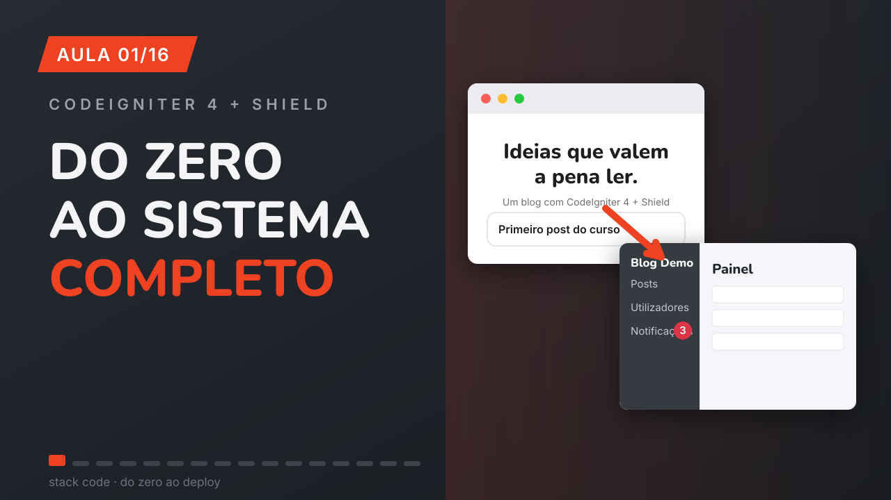](COLE_O_LINK_DA_AULA_01)<br>**Construí um sistema COMPLETO com CodeIgniter 4 + Shield (login, papéis, notificações) — e vou te ensinar do zero** | [▶ Assistir](COLE_O_LINK_DA_AULA_01) |
| 02 | [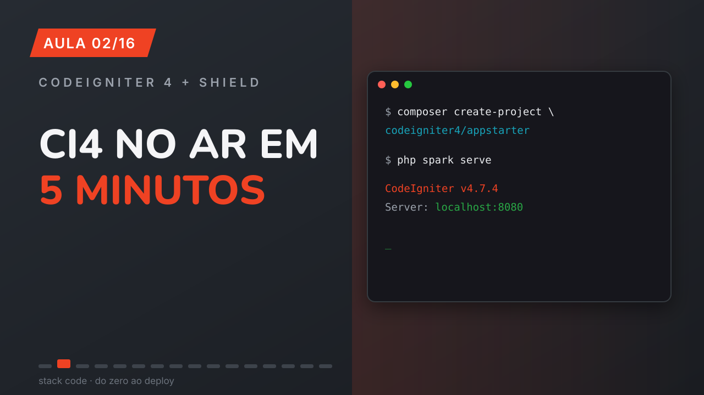](COLE_O_LINK_DA_AULA_02)<br>**CodeIgniter 4 em 2026: instalação do zero com Composer (PHP 8.3)** | [▶ Assistir](COLE_O_LINK_DA_AULA_02) |
| 03 | [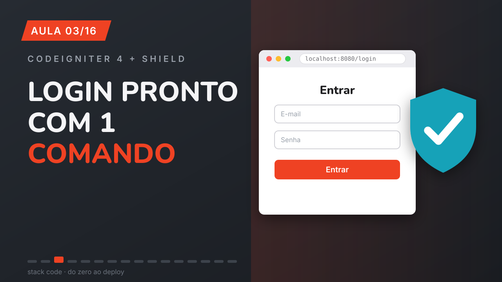](COLE_O_LINK_DA_AULA_03)<br>**Autenticação PRONTA no CodeIgniter 4 com Shield (login + registro em 1 comando)** | [▶ Assistir](COLE_O_LINK_DA_AULA_03) |
| 04 | [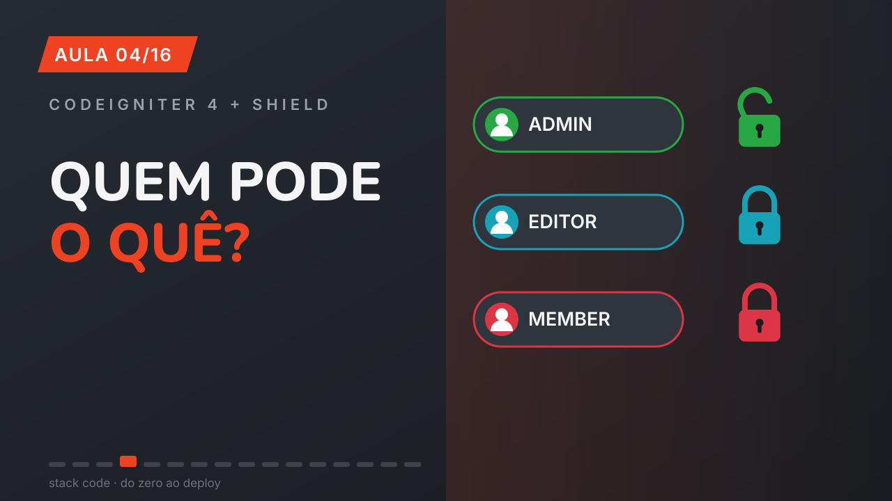](COLE_O_LINK_DA_AULA_04)<br>**Papéis de usuário no Shield: admin, editor e member (AuthGroups na prática)** | [▶ Assistir](COLE_O_LINK_DA_AULA_04) |
| 05 | [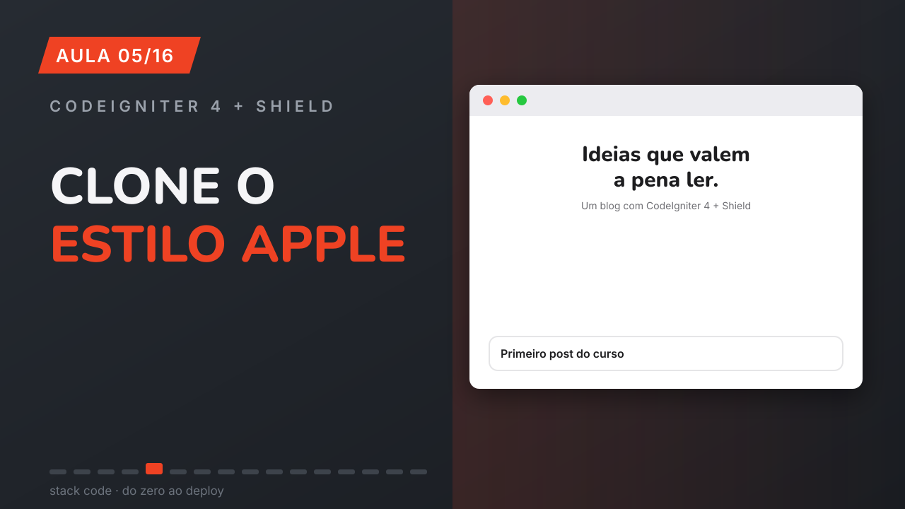](COLE_O_LINK_DA_AULA_05)<br>**Site PROFISSIONAL no CodeIgniter 4: Bootstrap 5 + layout estilo Apple (e login bonito no Shield)** | [▶ Assistir](COLE_O_LINK_DA_AULA_05) |
| 06 | [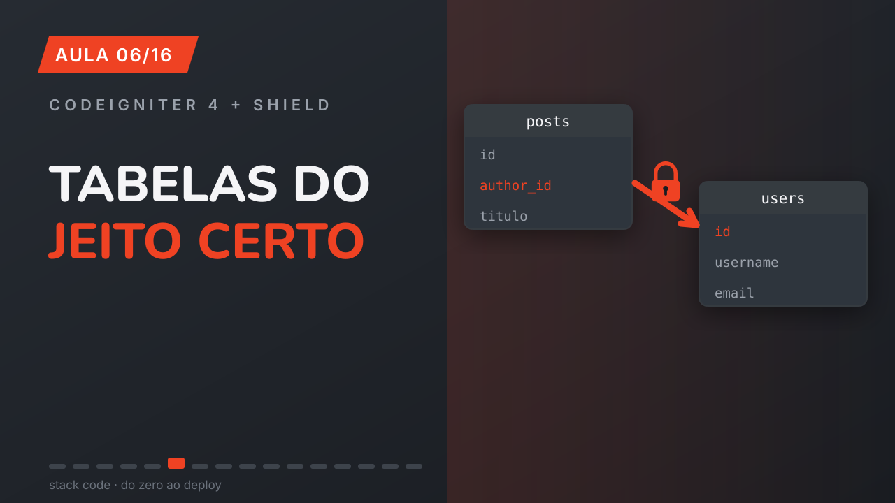](COLE_O_LINK_DA_AULA_06)<br>**Migrations no CodeIgniter 4: tabela posts com FOREIGN KEY para o Shield** | [▶ Assistir](COLE_O_LINK_DA_AULA_06) |
| 07 | [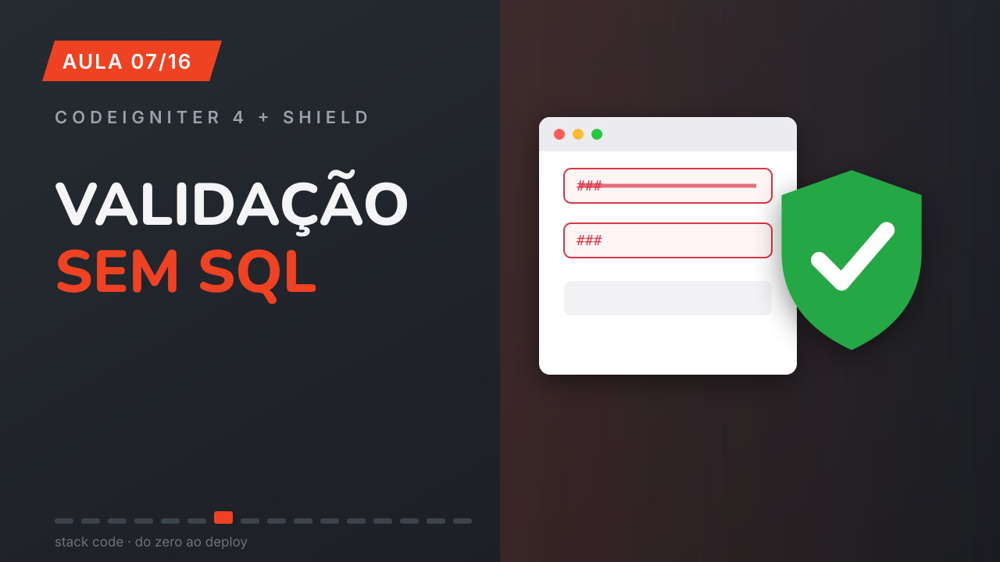](COLE_O_LINK_DA_AULA_07)<br>**Models no CodeIgniter 4: validação e soft delete SEM escrever SQL** | [▶ Assistir](COLE_O_LINK_DA_AULA_07) |
| 08 | [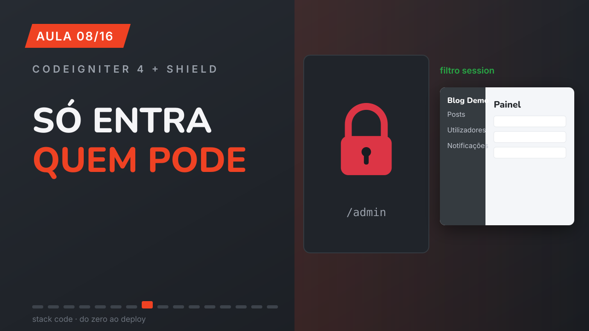](COLE_O_LINK_DA_AULA_08)<br>**Painel admin PROFISSIONAL no CodeIgniter 4: Bootstrap 5 + rotas protegidas com Shield** | [▶ Assistir](COLE_O_LINK_DA_AULA_08) |
| 09 | [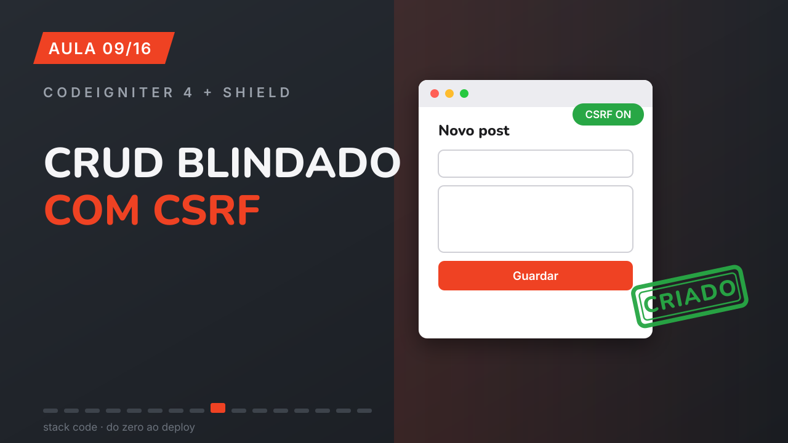](COLE_O_LINK_DA_AULA_09)<br>**CRUD no CodeIgniter 4 + Shield: criar posts com CSRF e autor automático** | [▶ Assistir](COLE_O_LINK_DA_AULA_09) |
| 10 | [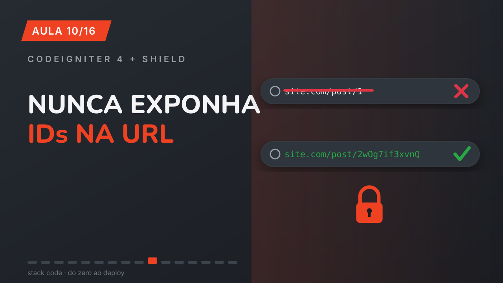](COLE_O_LINK_DA_AULA_10)<br>**NUNCA exponha IDs na URL: criptografia nativa no CodeIgniter 4** | [▶ Assistir](COLE_O_LINK_DA_AULA_10) |
| 11 | [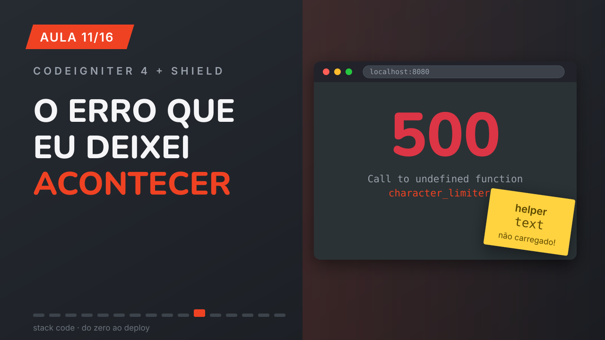](COLE_O_LINK_DA_AULA_11)<br>**Página pública com URL cifrada no CI4 (e o erro que TODO iniciante comete)** | [▶ Assistir](COLE_O_LINK_DA_AULA_11) |
| 12 | [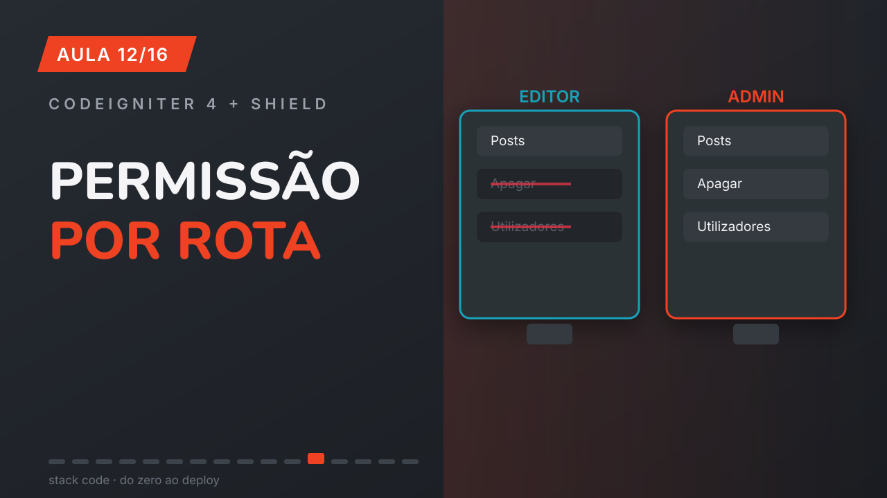](COLE_O_LINK_DA_AULA_12)<br>**Permissões por rota no Shield: filtro permission + can() no menu** | [▶ Assistir](COLE_O_LINK_DA_AULA_12) |
| 13 | [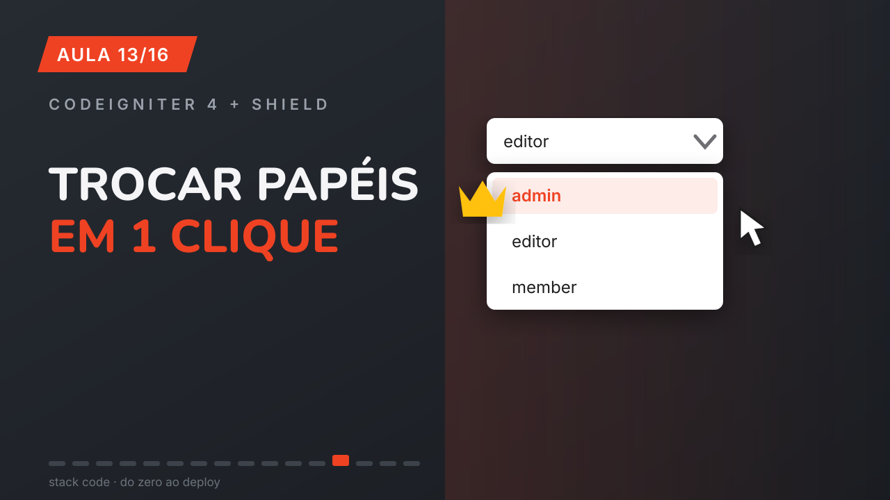](COLE_O_LINK_DA_AULA_13)<br>**Tela de gestão de usuários no Shield: trocar papéis com syncGroups()** | [▶ Assistir](COLE_O_LINK_DA_AULA_13) |
| 14 | [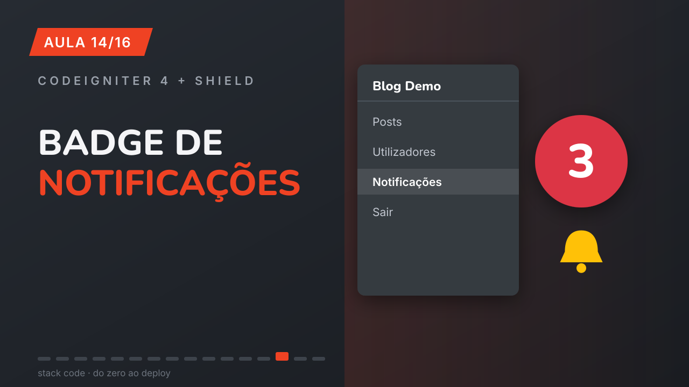](COLE_O_LINK_DA_AULA_14)<br>**Sistema de notificações internas no CodeIgniter 4 (com badge no menu)** | [▶ Assistir](COLE_O_LINK_DA_AULA_14) |
| 15 | [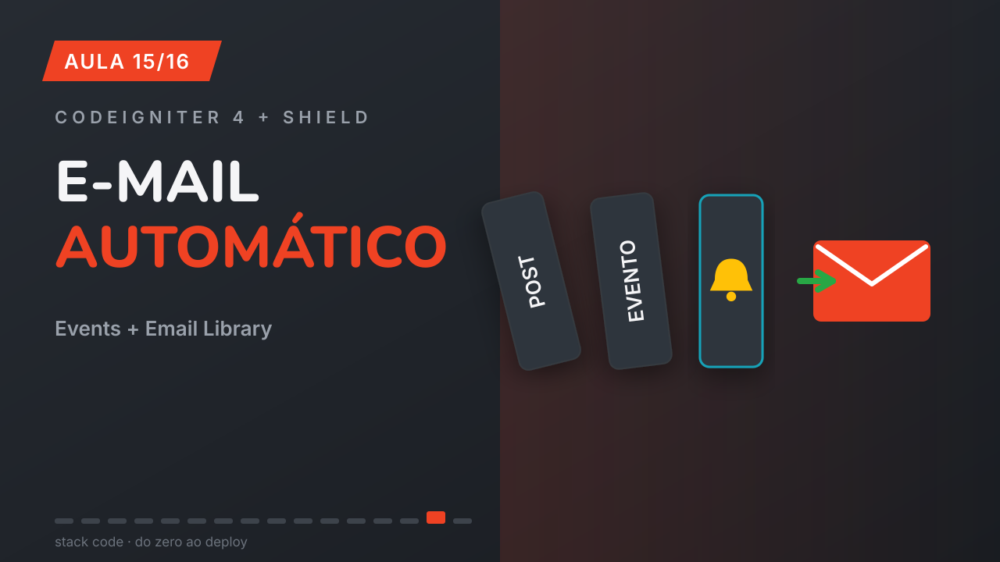](COLE_O_LINK_DA_AULA_15)<br>**Events + Email Library no CodeIgniter 4: e-mail automático quando algo acontece** | [▶ Assistir](COLE_O_LINK_DA_AULA_15) |
| 16 | [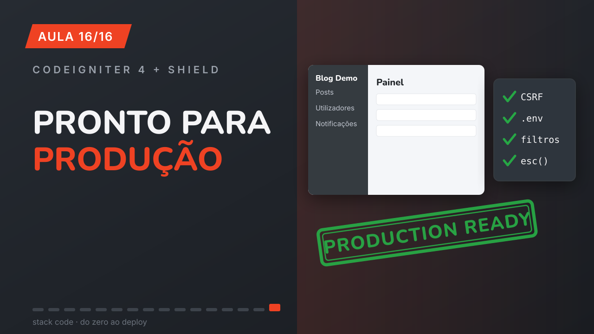](COLE_O_LINK_DA_AULA_16)<br>**Checklist FINAL: CodeIgniter 4 + Shield pronto para produção** | [▶ Assistir](COLE_O_LINK_DA_AULA_16) |

---

## ✨ O que este projeto tem

- **Autenticação completa com Shield** — login, registro e sessões, com telas customizadas na identidade do site
- **3 papéis de acesso** (`admin`, `editor`, `member`) com matriz de permissões declarativa e filtros `session`/`permission` nas rotas
- **Site público estilo apple.com** — Bootstrap 5.3, navbar com blur, hero, cards com hover e rodapé sempre no lugar
- **Painel admin responsivo** — sidebar offcanvas (fixa no desktop, gaveta no celular), dashboard com estatísticas, tabelas com badges
- **IDs cifrados na URL** — nada de `/post/1`; o Encryption Service nativo gera hashes que viram 404 se adulterados
- **CRUD de posts blindado** — validação no Model, CSRF por sessão, autor automático via `auth()->id()`, soft delete
- **Notificações internas** com badge em tempo real no menu
- **E-mails transacionais desacoplados** — `Events::trigger` no controller, envio no Service, falha de SMTP **nunca** derruba a ação do usuário

## 🚀 Como rodar

```bash
# 1. Clonar e instalar dependências
git clone https://github.com/salomaopena/blogapp.git
cd blogapp
composer install

# 2. Configurar o ambiente
cp env .env
# Edite o .env: CI_ENVIRONMENT, app.baseURL, app.indexPage e o banco (SQLite já vem pronto)

# 3. Criar o banco e as tabelas
php spark migrate --all

# 4. Criar o primeiro admin
php spark shield:user create
php spark shield:user addgroup   # adicionar ao grupo admin

# 5. Subir
php spark serve
```

Abra `http://localhost:8080` — o painel fica em `/admin`.

> 💡 **E-mails (Aula 15):** descomente o bloco `email.*` no final do `.env` e preencha com as credenciais do seu SMTP (ex.: [Mailtrap](https://mailtrap.io) para desenvolvimento). Sem isso, os e-mails apenas registram falha no log — o sistema continua funcionando.

## 🧰 Stack

| Camada | Tecnologia |
|--------|-----------|
| Backend | PHP 8.3 · CodeIgniter 4.7 |
| Autenticação | CodeIgniter Shield 1.3 |
| Frontend | Bootstrap 5.3 · Bootstrap Icons · Nunito + Inter |
| Banco | SQLite (dev) / MySQL (produção) |
| E-mail | Email Library nativa + Events |

## 📂 Estrutura em destaque

```
app/
├── Config/Auth.php          # views customizadas, redirects e grupos do Shield
├── Controllers/Admin/       # Dashboard, Posts, Usuarios (área protegida)
├── Libraries/IdCodec.php    # cifra/decifra IDs das URLs
├── Services/NotificacaoService.php  # notificações internas + e-mail
├── Config/Events.php        # post_criado → notificar admins
└── Views/
    ├── layouts/             # site.php (público) e admin.php (painel)
    ├── auth/                # login e registro com a cara do site
    └── admin/               # dashboard, posts, usuários, notificações
```

## 📜 Licença

Código aberto para fins educacionais — use, estude e evolua. Se este projeto te ajudou, dá uma ⭐ no repositório e se inscreva no canal!

---

<div align="center">

**Feito com ❤️ pelo canal [Salomão Pena](COLE_AQUI_O_LINK_DO_CANAL) · do zero ao deploy**

</div>
